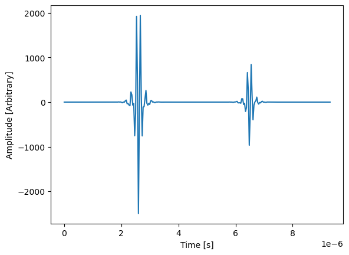

Installation
============

This guide explains how to install **PyMUST** on your system.

Prerequisites
-------------

Before installing, make sure you have:

- Python 3.9 or higher
- pip (Python package manager)
- (optional) virtualenv

You can check Python and pip versions:

.. code-block:: bash

   python3 --version
   pip3 --version

Installing with pip
-------------------

To install the stable release from PyPI:

.. code-block:: bash

   pip install pymust

Or usiung conda (it is recommended to create a separate environment)

.. code-block:: bash

   conda install -c conda-forge pymust

Installing from Source
----------------------

Clone the repository:

.. code-block:: bash

   git clone https://github.com/creatis-ULTIM/PyMUST
   cd pymust

Install with:

.. code-block:: bash

   pip install -e .

Using a Virtual Environment (recommended)
-----------------------------------------

Create and activate a virtual environment:

.. code-block:: bash

   python3 -m venv .venv
   source .venv/bin/activate   # Linux / macOS

   # or on Windows:
   # .venv\Scripts\activate

Then install:

.. code-block:: bash

   pip install pymust

Alternatively, you can install from source using a virtual environment

Verifying the Installation
--------------------------

To confirm that the installation succeeded, you can execute this snippet (also known as basic_example.ipynb):

.. code-block:: python

    import pymust, matplotlib.pyplot as plt
    param = pymust.getparam('L11-5V')
    param.Nelements = 1

    xScatterers = np.array([0,0])
    zScatterers = np.array([.2e-2, .5e-2])
    yScatterers = np.array([0,0])
    RCScatterers = np.array([1, 1])

    txDelays = np.zeros(param.Nelements).reshape((1, -1))

    RF, _ = pymust.simus(xScatterers,yScatterers,zScatterers,RCScatterers,txDelays,param)
    ts = np.arange(RF.shape[0]) / param.fs

    plt.plot(ts, RF[:,0])
    plt.xlim
    plt.xlabel('Time [s]')
    plt.ylabel('Amplitude [Arbitrary]')

You should obtain the following plot:

